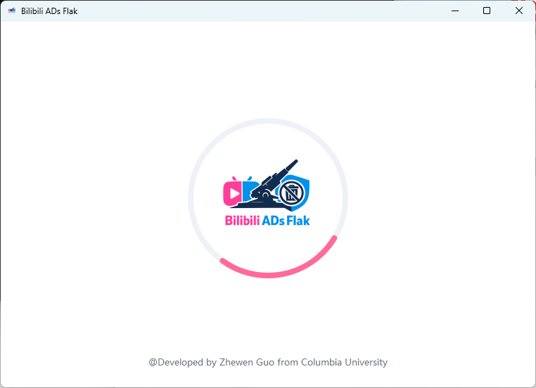
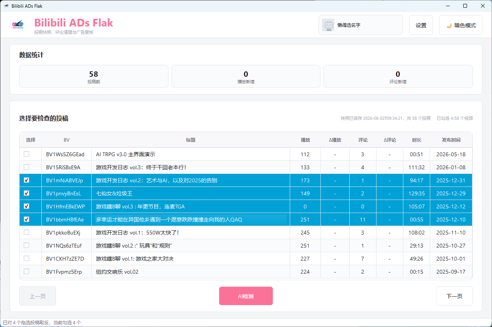
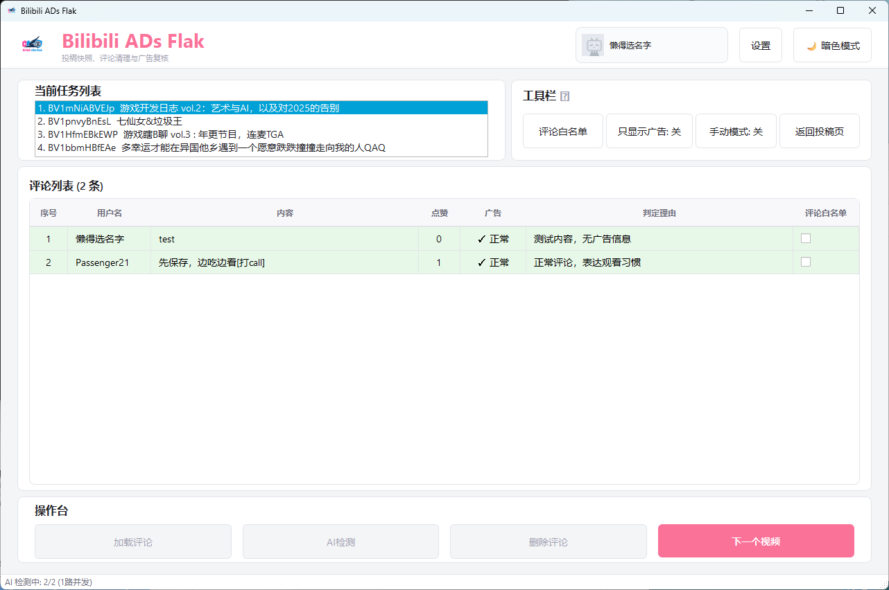

# Bilibili ADs Flak

一个给 B 站 UP 主使用的评论区广告清理助手。它可以读取你的投稿快照，批量选择需要检查的视频，爬取评论，用 DeepSeek 判断广告评论，并在人工复核后再删除。

## 能做什么

- 自动加载账号投稿列表，按视频选择要复查的评论区
- 爬取指定 B 站视频的一楼评论和楼中楼回复
- 使用 DeepSeek 对评论进行广告识别
- 在表格里查看评论内容、点赞数、广告判断和判断理由
- 支持只看广告、手动改判、用户白名单、评论白名单
- 删除前二次确认，并支持设置删除限速
- 支持亮色模式和暗色模式

## 界面总览

### 启动界面



启动时程序会自动检查本地配置，读取 `.env` 中的 Cookie 和 DeepSeek API Key，并尝试加载你的 B 站账号信息与投稿快照。

适合场景：

- 第一次打开软件时确认程序是否正常启动
- 等待 Cookie、API Key、投稿缓存加载
- 排查启动慢、未登录、API Key 未配置等问题

如果缺少 Cookie 或 API Key，软件会弹出配置窗口，引导你完成导入。

### 投稿爬取界面



这是批量复核的入口页，适合 UP 主从自己的投稿中挑选一批视频进入 AI 检测流程。

页面区域说明：

- 顶部账号卡：显示当前登录的 B 站账号。若显示未登录或凭证无效，需要重新导入 Cookie。
- `设置`：打开运行设置，可配置 AI 模型、API Key、爬取间隔、AI 最大并发、删除限速。
- `暗色模式` / `亮色模式`：切换界面主题，不影响数据和检测结果。
- 数据统计：显示已加载投稿数、播放新增、评论新增，用于快速判断最近哪些视频更值得检查。
- 投稿表格：展示 BV、标题、播放、评论、时长、发布时间等信息。
- 表格勾选框：选择要进入 AI 检测的视频。适合只检查近期发布、评论新增较多、或怀疑有广告的视频。
- `刷新`：重新拉取投稿快照。适合刚发布视频、刚导入 Cookie、或列表不是最新时使用。
- `上一页` / `下一页`：翻页浏览更多投稿。
- `AI检测`：把已勾选的视频加入复核任务列表，进入逐个视频的检测工作台。

推荐用法：

1. 先看数据统计和评论数，定位近期可能有广告的视频。
2. 在投稿表格中勾选要检查的视频。
3. 点击 `AI检测`，确认任务后进入复核工作台。

### AI 检测界面



这是逐个视频处理评论的工作台。它会按任务列表依次处理你在投稿页勾选的视频。

页面区域说明：

- 当前任务列表：显示本轮需要处理的视频。当前视频会高亮，处理完的视频会标记为已完成。
- `评论白名单`：打开白名单管理。适合把熟人、固定粉丝、置顶互动或不想删除的评论加入免删名单。
- `只显示广告`：只显示当前被判定为广告的评论。适合评论很多时快速复核可疑项。
- `手动模式`：开启后点击评论行，可在“广告”和“正常”之间切换。适合修正 AI 误判或漏判。
- `返回投稿页`：回到投稿选择界面。适合重新选择视频、刷新投稿快照、或中断当前批次。
- 评论列表：显示用户名、评论内容、点赞、广告判定、判定理由、评论白名单勾选框。
- 评论白名单勾选框：只对当前 BV 下的这条评论生效，勾选后不会被删除。

操作台按钮说明：

- `加载评论`：爬取当前视频评论。进入某个任务后先点它。
- `AI检测`：对已加载的评论进行广告识别。只有评论加载完成后才可用。
- `删除评论`：删除当前仍被判定为广告、且未命中白名单的评论。删除前会弹出确认框。
- `下一个视频`：跳过当前视频，进入任务列表里的下一个视频。

按钮高亮逻辑：

- 当前没有评论时，会直接高亮 `下一个视频`。
- AI 检测后没有广告，或广告都被手动改成正常，会跳过删除，直接高亮 `下一个视频`。
- 如果用户手动把正常评论标记为广告，会自动回退并高亮 `删除评论`。
- 如果广告评论被加入白名单，可删除数量变成 0，也会切到 `下一个视频`。

适合场景：

- 批量清理多个投稿的广告评论
- 对 AI 检测结果逐条复核，避免误删正常粉丝评论
- 只处理明显广告，把模糊评论留给人工判断
- 评论区没有广告时快速跳过当前视频

### 单视频评论爬取

软件也保留了单 BV 评论爬取能力，适合只想检查某一个视频时使用。

常用按钮：

- `预览`：输入 BV 后先查看视频标题和评论数，确认没有填错。
- `开始爬取`：开始抓取该视频评论，并实时写入表格。
- `取消`：中止正在进行的爬取。
- `检测广告评论`：对当前表格中的评论进行 AI 检测。
- `只看广告`：过滤表格，只保留广告判定项。
- `手动修改`：人工切换某条评论的广告/正常状态。
- `白名单`：管理免删用户和免删评论。
- `删除广告评论`：删除复核后仍被判定为广告的评论。

适合场景：

- 临时检查一个指定 BV
- 测试 Cookie、API Key、删除限速是否可用
- 在批量处理前先用小视频跑一遍完整流程

## 使用前准备

你需要准备：

- Windows 电脑
- 已安装 Anaconda 或 Miniconda
- 一个可以登录 B 站的浏览器
- 一个 DeepSeek API Key

项目默认使用名为 `baf` 的 conda 环境。如果你还没有这个环境，可以在项目根目录打开终端执行：

```powershell
conda create -n baf python=3.12 -y
conda activate baf
pip install -r requirements.txt
```

## 下载项目

```powershell
git clone <项目地址>
cd Bilibili-ADs-Flak
```

如果你是直接下载 ZIP，解压后进入项目文件夹即可。

## 启动 GUI

最简单的方式是双击：

```text
function demos/启动GUI.bat
```

也可以在项目根目录执行：

```powershell
conda run -n baf python src/gui/run.py
```

第一次启动时，程序会自动检查 `.env` 配置文件。如果没有，会自动创建一个默认 `.env`。

## 导入 B 站 Cookie

Cookie 用来确认你是视频 UP 主，并且用于读取投稿和删除评论。

推荐方式：

1. 先在浏览器里登录 bilibili.com。
2. 关闭浏览器，避免 Cookie 文件被占用。
3. 启动软件，在提示窗口里点击 `自动导入`。
4. 等待软件显示当前登录账号。

如果自动导入失败，可以点击 `手动导入`，填入：

- `SESSDATA`
- `bili_jct`

也可以双击：

```text
function demos/抓取B站Cookie.bat
```

## 配置 DeepSeek API Key

首次启动缺少 API Key 时，软件会弹出配置窗口。也可以在主界面点击 `设置`，再点击 API Key 的 `配置`。

保存后会写入 `.env`，下次启动会自动读取。

## 推荐工作流

1. 启动软件，确认账号已登录。
2. 在投稿页勾选需要检查的视频。
3. 点击 `AI检测` 创建任务。
4. 对每个视频依次点击 `加载评论` 和 `AI检测`。
5. 开启 `只显示广告` 快速复核可疑评论。
6. 使用 `手动模式` 修正误判或漏判。
7. 必要时把用户或评论加入白名单。
8. 确认无误后点击 `删除评论`。
9. 当前视频没有可删广告时，点击 `下一个视频`。

## 常见问题

### 启动后显示未登录

先确认你已经在浏览器登录 B 站，然后重新自动导入 Cookie。

### 自动导入 Cookie 失败

可以尝试：

- 关闭 Chrome / Edge / Firefox 后再导入
- 确认浏览器里已经登录 bilibili.com
- 使用 `手动导入`

### 投稿列表不是最新

点击投稿页的 `刷新`。如果仍然不更新，检查 Cookie 是否有效。

### AI 检测失败

检查：

- DeepSeek API Key 是否填写
- 网络是否正常
- `.env` 中是否有 `DEEPSEEK_API_KEY`

### 检测后没有广告，为什么直接到下一个视频

这是正常行为。当前没有可删除评论时，软件会跳过删除步骤，避免误点删除。你仍然可以开启 `手动模式`，把漏判评论标记为广告，按钮会自动切回 `删除评论`。

### 删除失败

常见原因：

- 当前账号不是该视频 UP 主
- Cookie 失效，需要重新导入
- 删除过快触发风控，可以降低删除限速

## 配置文件

程序会自动创建 `.env`，里面主要有：

```text
BAF_AUTH_MODE=anonymous
BAF_SESSDATA=
BAF_BILI_JCT=
DEEPSEEK_API_KEY=
DEEPSEEK_MODEL=deepseek-chat
```

正常使用时，不需要手动修改这个文件。通过 GUI 导入 Cookie 和填写 API Key 即可。

## 安全提醒

- `.env` 里包含 Cookie 和 API Key，不要发给别人。
- 删除评论不可逆，删除前一定先复核。
- 建议先用少量评论的视频测试完整流程。
- 白名单适合保护熟人、粉丝和你明确想保留的评论，但不要把明显广告长期加入白名单。

## 打包成 Windows 软件

如果你想把项目发给别人直接使用，可以在自己的电脑上打包：

```powershell
conda activate baf
pip install -r requirements-build.txt
python scripts/build_exe.py
```

打包完成后，把这个文件夹发给用户：

```text
dist/BilibiliADsFlak/
```

用户双击里面的 `BilibiliADsFlak.exe` 就能启动，不需要安装 Python、依赖或 IDE。

如果想生成单个 exe 文件，可以执行：

```powershell
python scripts/build_exe.py --onefile
```

注意：不要把你本机的 `.env` 一起发出去。软件第一次启动会在 exe 同目录自动创建新的 `.env`。
