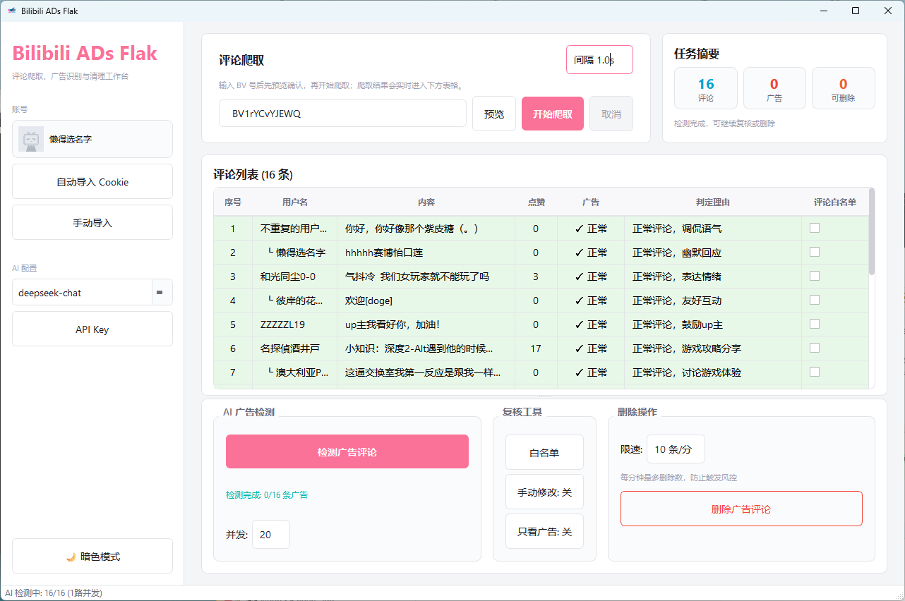

# Bilibili ADs Flak

一个给 B 站 UP 主使用的评论区广告清理助手。输入视频 BV 号，爬取评论，使用 AI 判断广告评论，复核后再删除。



## 能做什么

- 爬取指定 B 站视频的评论和楼中楼回复
- 使用 DeepSeek 对评论进行广告识别
- 在表格里查看评论内容、点赞数、广告判断和判断理由
- 支持白名单，避免误删熟人、粉丝或指定评论
- 支持手动修改 AI 判断结果
- 支持只看广告，快速复核可疑评论
- 删除前需要确认，并且可以设置删除限速
- 支持亮色模式和暗色模式

## 使用前准备

你需要准备：

- Windows 电脑
- 已安装 Anaconda 或 Miniconda
- 一个可以登录 B 站的浏览器
- 一个 DeepSeek API Key

项目默认使用名为 `baf` 的 conda 环境。如果你还没有这个环境，可以在项目根目录打开终端执行：

```powershell
conda create -n baf python=3.12 -y
conda activate baf
pip install -r requirements.txt
```

## 第一步：下载项目

```powershell
git clone <项目地址>
cd Bilibili-ADs-Flak
```

如果你是直接下载 ZIP，解压后进入项目文件夹即可。

## 第二步：启动 GUI

最简单的方式是双击：

```text
function demos/启动GUI.bat
```

也可以在项目根目录执行：

```powershell
conda run -n baf python src/gui/run.py
```

第一次启动时，程序会自动检查 `.env` 配置文件。如果没有，会自动创建一个默认 `.env`。

## 第三步：导入 B 站 Cookie

Cookie 用来确认你是视频 UP 主，并且用于删除评论。

推荐方式：

1. 先在浏览器里登录 bilibili.com
2. 关闭浏览器，避免 Cookie 文件被占用
3. 在 GUI 左侧点击 `自动导入 Cookie`
4. 等待提示当前登录账号

如果自动导入失败，可以点击 `手动导入`，填入：

- `SESSDATA`
- `bili_jct`

也可以双击：

```text
function demos/抓取B站Cookie.bat
```

## 第四步：配置 DeepSeek API Key

在 GUI 左侧点击 `API Key`，填入你的 DeepSeek API Key。

保存后会写入 `.env`，下次启动会自动读取。

## 第五步：爬取评论

1. 找到你想清理的视频 BV 号
2. 粘贴到 `评论爬取` 输入框
3. 点击 `预览`，确认视频标题和评论数
4. 点击 `开始爬取`
5. 等待评论出现在表格中

如果评论较多，可以适当调大 `间隔`，降低触发风控的概率。

## 第六步：检测广告评论

评论爬取完成后：

1. 点击 `检测广告评论`
2. 等待 AI 检测完成
3. 在表格中查看每条评论的结果

表格里会显示：

- 是否广告
- 判断理由
- 是否加入评论白名单

## 第七步：复核结果

删除前建议先复核一遍。

你可以使用：

- `只看广告`：只显示 AI 判断为广告的评论
- `手动修改`：点击广告列，手动切换广告/正常
- `白名单`：管理永远不删除的用户或评论
- 表格里的评论白名单勾选框：让当前 BV 下的某条评论免删

## 第八步：删除广告评论

确认无误后：

1. 设置删除限速，例如 `10 条/分`
2. 点击 `删除广告评论`
3. 在确认弹窗中再次确认
4. 等待删除完成

删除操作不可逆，请务必先复核。

## 常见问题

### 启动后显示未登录

先确认你已经在浏览器登录 B 站，然后重新自动导入 Cookie。

### 自动导入 Cookie 失败

可以尝试：

- 关闭 Chrome / Edge / Firefox 后再导入
- 确认浏览器里已经登录 bilibili.com
- 使用 `手动导入`

### AI 检测失败

检查：

- DeepSeek API Key 是否填写
- 网络是否正常
- `.env` 中是否有 `DEEPSEEK_API_KEY`

### 删除失败

常见原因：

- 当前账号不是该视频 UP 主
- Cookie 失效，需要重新导入
- 删除过快触发风控，可以降低删除限速

## 配置文件

程序会自动创建 `.env`，里面主要有：

```text
BAF_AUTH_MODE=anonymous
BAF_SESSDATA=
BAF_BILI_JCT=
DEEPSEEK_API_KEY=
DEEPSEEK_MODEL=deepseek-chat
```

正常使用时，不需要手动修改这个文件。通过 GUI 导入 Cookie 和填写 API Key 即可。

## 安全提醒

- `.env` 里包含 Cookie 和 API Key，不要发给别人
- 删除评论前一定先复核
- 建议先用少量评论的视频测试完整流程

## 打包成 Windows 软件

如果你想把项目发给别人直接使用，可以在自己的电脑上打包：

```powershell
conda activate baf
pip install -r requirements-build.txt
python scripts/build_exe.py
```

打包完成后，把这个文件夹发给用户：

```text
dist/BilibiliADsFlak/
```

用户双击里面的 `BilibiliADsFlak.exe` 就能启动，不需要安装 Python、依赖或 IDE。

如果想生成单个 exe 文件，可以执行：

```powershell
python scripts/build_exe.py --onefile
```

注意：不要把你本机的 `.env` 一起发出去。软件第一次启动会在 exe 同目录自动创建新的 `.env`。
